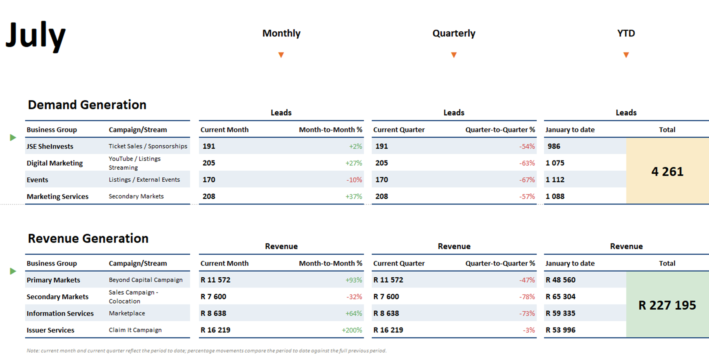
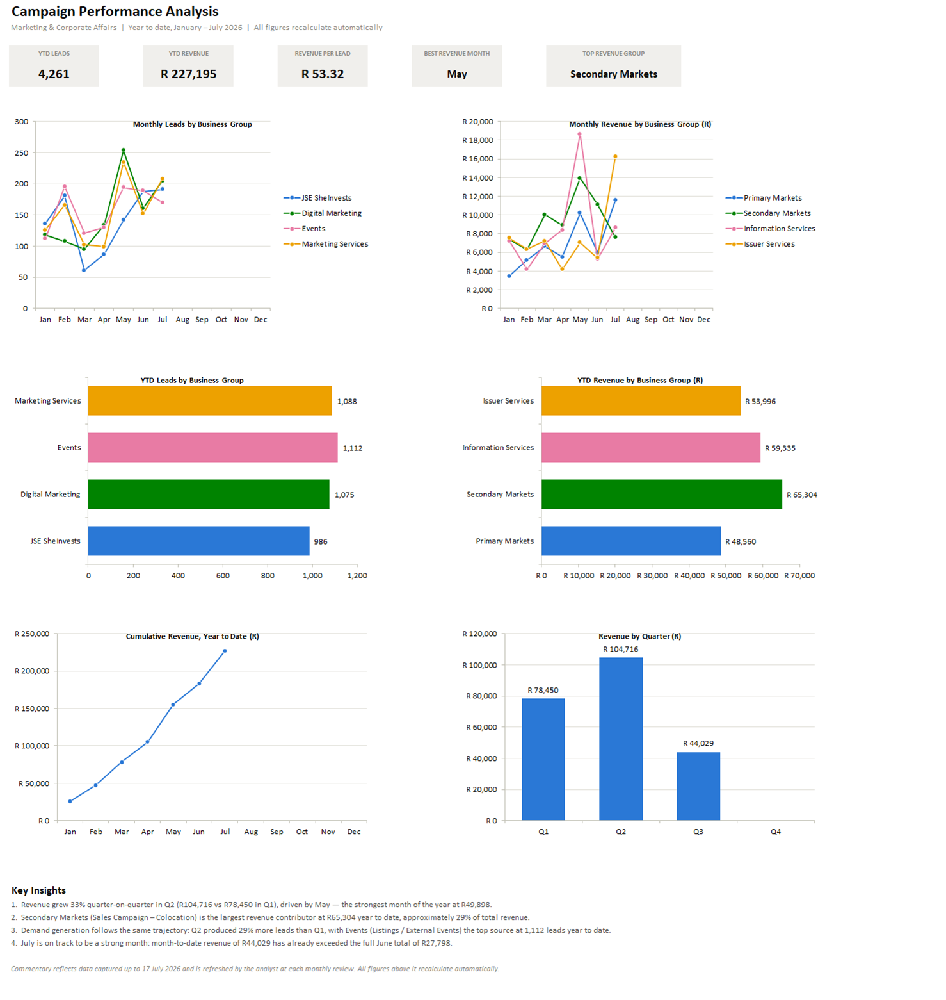
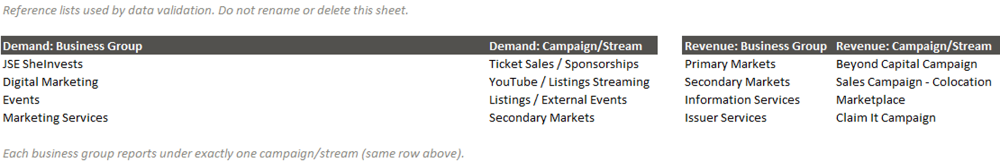
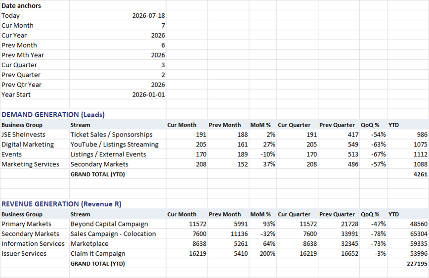
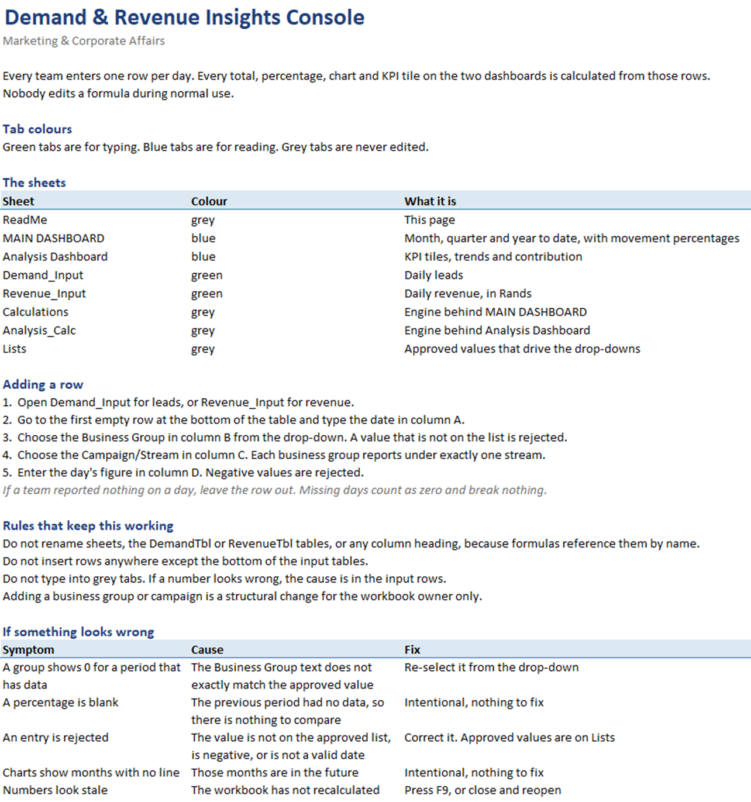

# Demand & Revenue Insights Console

**I replaced eight teams' worth of hand-built month-end reporting with one workbook: a team types four values a day, and every figure on its two dashboards recalculates itself.**

The Marketing & Corporate Affairs division of the Johannesburg Stock Exchange runs campaigns for four revenue divisions, Primary Markets, Secondary Markets, Information Services and Issuer Services, and four demand teams, JSE SheInvests, Digital Marketing, Events and Marketing Services. Each wanted to know how its campaigns were performing this month against last month, this quarter against last quarter, and for the year so far, but each team kept its results in its own file and its own format, month-end summaries were assembled by hand, and the reporting periods were defined differently from file to file, so the totals never reconciled across the eight groups.

The workbook I built replaces all eight files. A team enters one row per day: the date, its business group, its campaign, and the day's figure. Every total, percentage, chart and summary tile on the two dashboards is calculated from those rows, and the period boundaries are worked out from the computer's own date, so opening the file in a new month moves every comparison forward without anyone touching it.

|              8              |              4              |                 0                 |             1             |
| :--------------------------: | :-------------------------: | :--------------------------------: | :--------------------------: |
| Business groups on one page, previously eight separate files | Values a team types per row, three of them from drop-down lists | Formulas anyone entering data can break | Date the whole workbook rolls forward from, taken from the computer itself |

## Start Here

| File                                                                                                   | What it is                                                                                                                                                              |
| ------------------------------------------------------------------------------------------------------ | ------------------------------------------------------------------------------------------------------------------------------------------------------------------------ |
| [**MCA_Revenue_Demand_Generation_Report.xlsx**](MCA_Revenue_Demand_Generation_Report.xlsx) **(open this first)** | The console itself. Eight sheets: two dashboards, two calculation sheets, two input sheets, the approved value lists, and an instruction page. It opens on the instruction page |

There is nothing to install and no external data source to connect. The workbook contains no macros, meaning no embedded program code, so it opens without a security warning.

## What The Outputs Show

### The Tracking Dashboard



The `MAIN DASHBOARD` sheet reports the current month, the current quarter and the year so far for all eight business groups. Each figure is paired with a movement percentage: the current month against the whole of the previous month, and the current quarter against the whole of the previous quarter. Those percentages are coloured green when positive, red when negative and grey when zero, by a rule attached to the cells that reads the value and applies the colour, so nothing is coloured by hand.

The month name in the top left corner, `July` in the screenshot, is calculated from the computer's date rather than typed. The two block totals on the right are the year-to-date figures for all four groups added together: 4,261 leads and R227,195.

A lead here means one potential customer that a campaign produced, counted on the day it was produced.

The sheet has a footnote in cell B20 stating that the current month and current quarter cover the period so far, and that the movement percentages compare that partial period against a complete previous one. That is the single most easily misread thing on the page, which is why it is written on the page. It explains why every quarter-to-quarter percentage in the screenshot is steeply negative: the quarter shown had 17 days of data against a full previous quarter of 91.

### The Analysis Dashboard



The `Analysis Dashboard` sheet holds five summary tiles across the top and six charts below them. The tiles report year-to-date leads, year-to-date revenue, revenue per lead, the highest revenue month so far, and the business group with the highest revenue so far. The last two are not typed in; they are found by searching the monthly and per-group columns for the largest value and returning the label beside it.

The six charts are monthly leads by business group, monthly revenue by business group, year-to-date leads by business group, year-to-date revenue by business group, cumulative revenue, and revenue by quarter. Each business group keeps the same colour on every chart it appears on, so the charts can be compared with one another.

The two monthly line charts stop at the current month instead of dropping to zero for months that have not happened yet. That is deliberate. For any month starting after today the calculation sheet returns `NA()`, a value Excel treats as "no data", and Excel breaks the line at that point rather than plotting a false zero. The quarterly chart behaves the same way, which is why Q4 is absent from the screenshot rather than shown as a bar of zero.

## Where The Data Comes From

**What one row represents.** One row is one business group's total for one campaign on one day. Leads and revenue are recorded separately, on `Demand_Input` and `Revenue_Input`, because they are produced by different teams. Both sheets have the same four columns.

| Sheet            | Columns                                                             |
| ---------------- | ------------------------------------------------------------------- |
| `Demand_Input`   | `Date`, `Business Group`, `Campaign/Stream`, `Daily Leads (count)`  |
| `Revenue_Input`  | `Date`, `Business Group`, `Campaign/Stream`, `Daily Revenue (R)`    |

**Period and volume.** The rows published in this copy run from 01/01/2026 to 17/07/2026. `Demand_Input` holds 198 rows across 80 separate dates, and `Revenue_Input` holds 184 rows across 80 separate dates, so 382 rows in total. Teams do not report every day, and a day with no row counts as zero without breaking anything.


**How it is entered, and the condition it is in.** Nothing is imported. Each row is typed by a person, which means the workbook has to reject a bad entry at the moment it is made rather than repair it afterwards, because there is no later stage at which anyone would notice. All four columns carry a rule that refuses an entry failing it:

| Column            | Rule applied                                                                                              |
| ----------------- | --------------------------------------------------------------------------------------------------------- |
| `Date`            | Must be a date on or after 01/01/2020                                                                       |
| `Business Group`  | Must be chosen from a drop-down list of the four approved names for that sheet                              |
| `Campaign/Stream` | Must be chosen from a drop-down list of the four approved campaign names for that sheet                     |
| Daily figure      | Leads must be a whole number of zero or more; revenue must be a number of zero or more, decimals permitted  |

Each rule shows its own message when it rejects something. Entering an unapproved business group returns "Select a business group from the drop-down list. Valid values are maintained on the Lists sheet."

This matters more than it first appears. A misspelled business group would not produce an error anywhere. It would simply report zero for that team on every dashboard, and nobody would find out until someone asked why a campaign had stopped producing results. The drop-down is what prevents that.

The approved names are kept on one sheet, `Lists`, and referred to by the names `DemandGroups`, `DemandStreams`, `RevenueGroups` and `RevenueStreams`. A name here is a label given to a block of cells so that other parts of the workbook can refer to it by that label instead of by its position.



## How It Works

```
Demand_Input                             Revenue_Input
  198 rows: date, business group,          184 rows: date, business group,
  campaign, daily leads                    campaign, daily revenue in Rand
  every column checked on entry            every column checked on entry
  held in the table named DemandTbl        held in the table named RevenueTbl
        |                                        |
        +-------------------+--------------------+
        |                                        |
        v                                        v
   Calculations                             Analysis_Calc
   Date anchors from TODAY(), then          One row per month for all 12 months,
   current month, previous month,           quarterly totals, year-to-date share
   current quarter, previous quarter        per business group, and the five
   and year to date, per business group     values the summary tiles display
        |                                        |
        v                                        v
   MAIN DASHBOARD                           Analysis Dashboard
   Totals and movement percentages,         Five summary tiles and six charts
   coloured green, red or grey
```

The three layers never mix. The two input sheets contain data and no formulas. The two calculation sheets contain every formula. The two dashboard sheets contain no calculations at all; each of their cells simply displays a cell from a calculation sheet. That separation is what allows the appearance of a dashboard to be changed without any risk to the numbers behind it, and the reverse.

Both input sheets are Excel tables, meaning a named block of rows and columns that extends when a row is added at the bottom. Every formula refers to `DemandTbl` and `RevenueTbl` by name rather than by a range of cell addresses, so a new row is included in every total automatically and no range needs widening.



The workbook opens on its own instruction page, the `ReadMe` sheet, which sets out the tab colour convention (green tabs are for typing, blue tabs are for reading, grey tabs are never edited), the five steps for adding a row, the four rules that keep the formulas intact, and a table of five symptoms with their cause and their fix. Anyone who downloads the file has the instructions in front of them without needing anything else.



## The Calculation Method In Full

Every figure on the tracking dashboard is bounded by nine cells at the top of the `Calculations` sheet, which work out the period boundaries from the computer's date. `TODAY()` returns today's date, and the eight cells below it derive everything else from it:

```excel
B2  =TODAY()                    today's date
B3  =MONTH(B2)                  current month as a number, 1 to 12
B4  =YEAR(B2)                   current year
B5  =IF(B3=1,12,B3-1)           previous month
B6  =IF(B3=1,B4-1,B4)           the year that previous month belongs to
B7  =ROUNDUP(B3/3,0)            current quarter, 1 to 4
B8  =IF(B7=1,4,B7-1)            previous quarter
B9  =IF(B7=1,B4-1,B4)           the year that previous quarter belongs to
B10 =DATE(B4,1,1)               1 January of the current year
```

The year boundary is handled rather than left to fail. In January the previous month is December of the previous year, so the month and the year it belongs to both have to change, which is what cells B5 and B6 do together. Cells B8 and B9 carry Q1 back to Q4 of the previous year in the same way.

Every figure below those anchors is a `SUMIFS` formula, which adds up the numbers in one column of a table for every row meeting a set of conditions. Each one is wrapped in `IFERROR`, which returns a chosen result instead of an error message, so a period with no prior data returns a blank or a zero rather than a division error on the face of the dashboard.

### One Figure Traced From Beginning To End

The screenshots were taken with the workbook calculated on 29/07/2026, so `TODAY()` returned that date, cell B3 held 7 and cell B4 held 2026. Take the first line of the demand table, JSE SheInvests, and follow all six of its figures.

**Current month, 191 leads.** Cell C14 adds the `Daily Leads (count)` column of `DemandTbl` for every row where the business group is JSE SheInvests and the date falls on or after 1 July 2026 and before 1 August 2026:

```excel
=IFERROR(SUMIFS(DemandTbl[Daily Leads (count)],
                DemandTbl[Business Group], $A14,
                DemandTbl[Date], ">="&DATE($B$4,$B$3,1),
                DemandTbl[Date], "<"&DATE($B$4,$B$3+1,1)), 0)
```

Neither boundary is a typed date. The lower one is built from the current year and the current month, and the upper one from the current year and the month after it. In December that upper boundary becomes month 13, which Excel reads as January of the following year, so the formula needs no special case for the end of the year.

**Previous month, 188 leads.** Cell D14 is the same formula using cells B5 and B6, the previous month and the year it belongs to, in place of B3 and B4.

**Month-to-month movement, +2%.** Cell E14 is `=IFERROR((C14-D14)/D14,"")`, so (191 - 188) / 188 = 0.0160, displayed as +2% and coloured green because it is above zero.

**Current quarter, 191 leads.** Cell F14 runs from 1 July 2026, the first month of quarter 3, up to but not including 1 October 2026. It equals the month figure because July is the only month of that quarter with any data.

**Previous quarter, 417 leads.** Cell G14 runs from 1 April 2026 to 1 July 2026. The upper boundary is `EDATE(DATE($B$9,($B$8-1)*3+1,1),3)`, where `EDATE` adds three months to a date, which lands the boundary on the correct day whichever quarter it is and whichever year that quarter belongs to. The figure is April's 87 plus May's 142 plus June's 188.

**Quarter-to-quarter movement, -54%.** Cell H14 gives (191 - 417) / 417 = -0.5420, displayed as -54% and coloured red. This is the figure the footnote exists for. It compares 17 days of July against three complete months, so it is a statement about how much of the quarter has elapsed, not about performance.

**Year to date, 986 leads.** Cell I14 runs from 1 January 2026 to today, and is the sum of that group's seven monthly figures: 136, 181, 61, 87, 142, 188 and 191.

The tracking dashboard then displays these six cells and nothing more. Cell E8 on `MAIN DASHBOARD` contains `=Calculations!C14`, cell F8 contains `=Calculations!E14`, and so on down the block.

The second calculation sheet, `Analysis_Calc`, applies the same approach across all twelve months of the year at once. Each month's cell is `=IF($B4>TODAY(),NA(),SUMIFS(...))`, so a month that has not started yet returns "no data" and the chart line breaks there instead of dropping to zero. Two further columns hold the same monthly figures with `IFERROR` converting "no data" to zero, which is what the cumulative and quarterly totals add up, so a future month contributes nothing to them rather than making them fail.

## What The Published Copy Reports

The figures below are what the workbook calculates from the 382 generated rows in this repository, on the 29/07/2026 calculation shown in the screenshots. They demonstrate that the reporting works and are not real campaign results.

**1.** Leads are evenly spread across the four demand teams. Year to date, Events produced 1,112 leads (26.1% of the total), Marketing Services 1,088 (25.5%), Digital Marketing 1,075 (25.2%) and JSE SheInvests 986 (23.1%), giving 4,261 in total. No team is more than three percentage points from any other.

**2.** Revenue is more concentrated than leads. Secondary Markets produced R65,304 (28.7%), Information Services R59,335 (26.1%), Issuer Services R53,996 (23.8%) and Primary Markets R48,560 (21.4%), giving R227,195. The gap between the highest and lowest group is R16,744.

**3.** Revenue per lead is R53.32, which is R227,195 divided by 4,261, the only figure on either dashboard that combines the two input sheets.

**4.** Q1 produced R78,450 and Q2 produced R104,716, an increase of R26,266, but Q3 shows only R44,029 because it covers 17 days rather than three months, which is why the footnote on the tracking dashboard sets out what the quarter columns compare. May was the strongest single month at R49,898.

**5.** In the month-to-month column, Issuer Services shows +200%, R16,219 in July against R5,410 in June, and Secondary Markets shows -32%, R7,600 against R11,136. In the quarter-to-quarter column every group is negative, because each compares 17 days against 91: the colouring is separating real movement from partial-period movement, not marking underperformance.

## What The Division Does With It

Each team enters its own rows. A team opens the green sheet for its measure, goes to the first empty row at the bottom, and enters four values, three of them chosen from drop-down lists. Nothing else is required of the person entering data, and nothing they do can alter a formula.

The tracking dashboard answers the monthly reporting question: the current month and quarter against the previous one for all eight groups on a single page, defined as a print area of A1:L32 in landscape so that it prints on one page for a meeting.

The analysis dashboard answers the direction question. The monthly lines show which groups are rising and falling over the year, the year-to-date bars show each group's share, and the cumulative revenue line shows the year's total building month by month.

The written comment stays a human judgement. The dashboards have headings for `Insights` and `Looking Ahead` on the tracking sheet and `Key Insights` on the analysis sheet, left empty in this copy. The note in cell B74 of the analysis sheet states the position directly: the commentary is written by the analyst at each monthly review, while every figure above it recalculates on its own.

## Limitations And Assumptions

- The two drop-down lists are independent of each other. The `Business Group` list and the `Campaign/Stream` list are checked separately, so an approved group can be paired with an approved campaign belonging to a different group and the workbook will accept it. The `Lists` sheet states that each business group reports under exactly one campaign, but that pairing is not enforced by a rule.
- The validation rules cover rows 2 to 3000. Beyond row 3000 an entry is no longer checked. At the current rate of roughly 380 rows in seven months, that is several years of entry, but it is a fixed limit and not an unlimited one.
- One calendar year is reported at a time. Every month on `Analysis_Calc` is built from the current year, so on 1 January the trend charts restart and the previous year's months are no longer displayed. The rows themselves remain in the input tables, but the workbook does not compare a month against the same month a year earlier.
- Year to date means from 1 January. If the division reports on a financial year that starts in another month, the year-to-date column and the `January to date` heading would both need changing.
- A missing row and a genuine zero are the same thing. A day on which a team reported nothing and a day on which a team produced nothing both contribute zero; the workbook does not distinguish between the two cases.
- The current month and quarter are always partial. Every movement percentage compares an incomplete period against a complete one. This is stated on the dashboard, but it remains the figure most likely to be quoted out of context.
- The screenshots were taken on 29/07/2026 and the sample rows stop on 17/07/2026. Because the period boundaries come from the computer's date, opening this copy after July 2026 will show zero for the current month until rows for that month are added. That is the workbook working correctly, not a fault.
- Nothing is verified against a source. Each figure is what a team typed. The validation rules confirm that an entry is a permitted kind of value, not that it is the correct value.

## Next Steps

- Make the campaign drop-down depend on the business group already chosen, so that the one-campaign-per-group pairing stated on the `Lists` sheet is enforced rather than described.
- Keep the previous year's months available on the trend charts, so that a month can be compared against the same month a year earlier as well as against the month before it.
- Add a completeness check that reports how many days in the current month each business group has submitted, so that a low figure caused by missing rows can be told apart from a low figure caused by low performance.
- Extend or remove the row 3000 limit on the validation rules before the input tables approach it.

## About The Data

**Every figure in this repository is generated.** The 198 rows in `Demand_Input` and the 184 rows in `Revenue_Input` were produced to populate the workbook and demonstrate that the reporting works, and they contain no real campaign results. Every number quoted anywhere on this page, and every number in the screenshots, comes from those generated rows.

What was preserved is the structure the division actually reports on: the eight business group names, the four demand campaigns and four revenue campaigns each of them reports under, the four columns of each input sheet, and the daily granularity of entry. What was replaced is the measured quantities themselves, meaning the lead counts and the Rand amounts.

The workbook records team totals for a day. It holds no personal information of any kind: no individual's name, no email address, no telephone number and no registration number appear anywhere in the file, in the published copy or in the version the division uses.

Only the numbers were invented. The workbook itself, meaning its sheets, formulas, validation rules, dashboards and charts, is the one built for the division.

## Author And Contact

**Ndivhuwo Makhavhu**, data analyst. Design, build and documentation.

- Email: [ndivhumakhavhu@gmail.com](mailto:ndivhumakhavhu@gmail.com)
- LinkedIn: [www.linkedin.com/in/ndivhuwo-makhavhu](https://www.linkedin.com/in/ndivhuwo-makhavhu)
- GitHub: [github.com/MainDevWork](https://github.com/MainDevWork)
- Project: [Demand_Revenue_Insights_Console](https://github.com/MainDevWork/Demand_Revenue_Insights_Console)

[**Back to the top**](#demand--revenue-insights-console)
